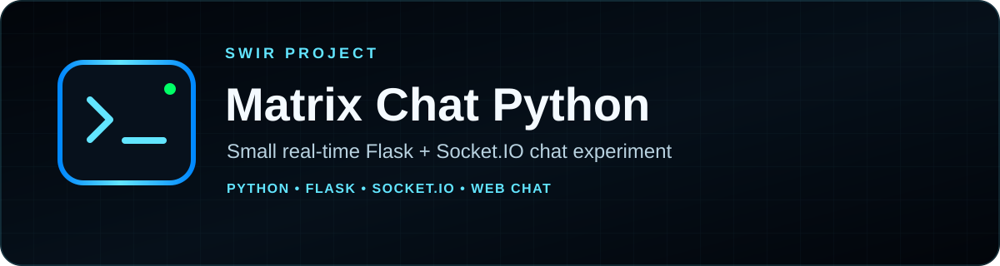
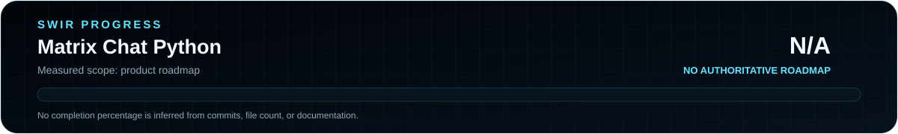

<!-- SWIR-README-STANDARD:v2 -->

<div align="center">



<br>


<br>


[](https://github.com/Swir)
[](https://github.com/Swir/Matrix-czat-pythom/stargazers)

<br>

[**Highlights**](#-highlights) · [**Current Run Path**](#-current-run-path) · [**Status**](STATUS.md) · [**Limitations**](#-limitations--security)

</div>

Matrix Chat Python is a compact real-time web-chat experiment built with **Flask**, **Flask-SocketIO**, HTML, CSS and JavaScript. Connected clients can exchange messages and receive the current in-memory message history.


## 📍 Project Status



Product progress: **N/A** — there is no authoritative measurable product roadmap, so file count, commits or documentation are not converted into a completion percentage.

| Item | Status |
|---|---|
| Current stage | Development / experiment |
| Backend | Flask + Flask-SocketIO |
| Frontend | HTML + CSS + JavaScript |
| Public releases | **None** |
| Product progress source | [STATUS.md](STATUS.md) |

## 🚀 Overview

The server keeps message history in RAM and broadcasts messages to connected Socket.IO clients. The browser interface uses a terminal-inspired visual style and connects explicitly to `http://localhost:5000`.

The repository is intentionally small, but the current checkout is **not arranged as a normal single-process Flask app**: `server.py` calls `render_template('index.html')`, while `index.html`, `matrix_chat.css` and `matrix_chat.js` currently live at repository root instead of Flask `templates/` and `static/` directories. This README documents that limitation instead of pretending the current source tree is turnkey.

## ✨ Highlights

| Feature | What it does |
|---|---|
| ⚡ Real-time messaging | Uses Socket.IO events between browser clients and the Flask server |
| 📣 Broadcast | Sends each received message to connected clients |
| 🧠 In-memory history | Sends the current process-local message history to newly connected users |
| 🟢 Terminal-inspired UI | Provides a lightweight Matrix-style visual presentation |
| ⌨️ Enter-to-send | Sends non-empty messages from the input field with Enter or the button |
| 🪶 Small codebase | Keeps the networking and frontend flow easy to inspect |

## ⚙️ Current Run Path

Install the Python dependencies:

```bash
git clone https://github.com/Swir/Matrix-czat-pythom.git
cd Matrix-czat-pythom
python -m pip install flask flask-socketio
```

Because the current source layout does not place the frontend in Flask's template/static directories, the least-invasive local workflow is to run the Socket.IO backend and serve the repository frontend separately.

Terminal 1:

```bash
python server.py
```

Terminal 2:

```bash
python -m http.server 8000
```

Then open:

```text
http://localhost:8000/index.html
```

The JavaScript client connects to the Socket.IO backend at `http://localhost:5000`. Visiting Flask's `/` route directly is expected to fail with the current file layout until the runtime structure is corrected.

Documentation progress check:

```bash
python tools/readme_progress.py --check
```

## 📋 Requirements / Compatibility

- Python with `flask` and `flask-socketio` installed.
- A modern browser capable of running the frontend JavaScript.
- The frontend currently loads Socket.IO client **4.2.0** from cdnjs.
- The current JavaScript is configured for a backend on `localhost:5000`.

No broader production-hosting compatibility is claimed.

## 🎮 Message Flow

```text
Browser client(s)
      │
      │ Socket.IO
      ▼
Flask-SocketIO server
      │
      ├─ broadcasts incoming messages
      └─ keeps process-local message history in RAM
```

New clients receive the current `message_history`. Each broadcast contains the connection SID and message text; the frontend inserts message text using `textContent`.

## 🧠 Technology / Architecture

| Layer | Technology / role |
|---|---|
| Backend | Flask + Flask-SocketIO |
| Client transport | Socket.IO |
| Frontend | HTML, CSS and vanilla JavaScript |
| History | Python in-memory list |
| Current server mode | Flask-SocketIO debug/development mode |

## 📦 Releases

There are currently **no GitHub Releases** for this repository. Run from source only; do not expect a packaged build or installer.

## ⚠️ Limitations / Security

This repository is a development experiment, not a production messaging service.

- No authentication or user identity system.
- Message history exists only in RAM and is lost on restart.
- `cors_allowed_origins="*"` is enabled in the current server.
- The server starts with `debug=True` in the current source.
- No persistence, HTTPS termination, rate limiting or production deployment configuration is included.
- The repository root layout does not match Flask's default template/static structure, so a direct `/` request is not a reliable start path in the current checkout.

Review and fix those areas before exposing the service beyond a controlled local/development environment.

## 🔎 Search Keywords

`Flask Socket.IO chat` • `Python realtime chat` • `Flask web chat example` • `Socket.IO Python example` • `Matrix style web chat` • `Python chat source code` • `realtime messaging Flask` • `Flask-SocketIO example` • `in-memory chat server` • `HTML JavaScript chat UI` • `local realtime chat` • `Python websocket-style chat`


<div align="center">

### `CONNECT • MESSAGE • LEARN • EVOLVE`

⭐ **If this experiment is useful, consider leaving a star.**

[**← SWIR profile**](https://github.com/Swir) · [**All projects →**](https://github.com/Swir?tab=repositories)

</div>
